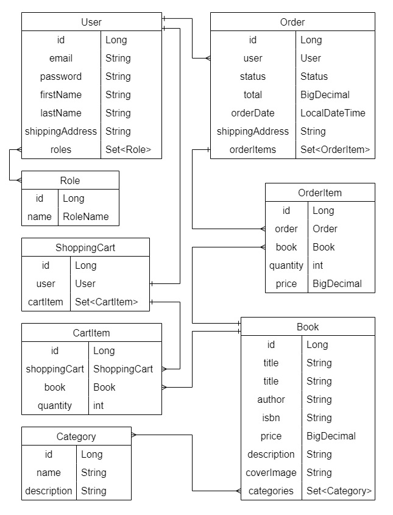
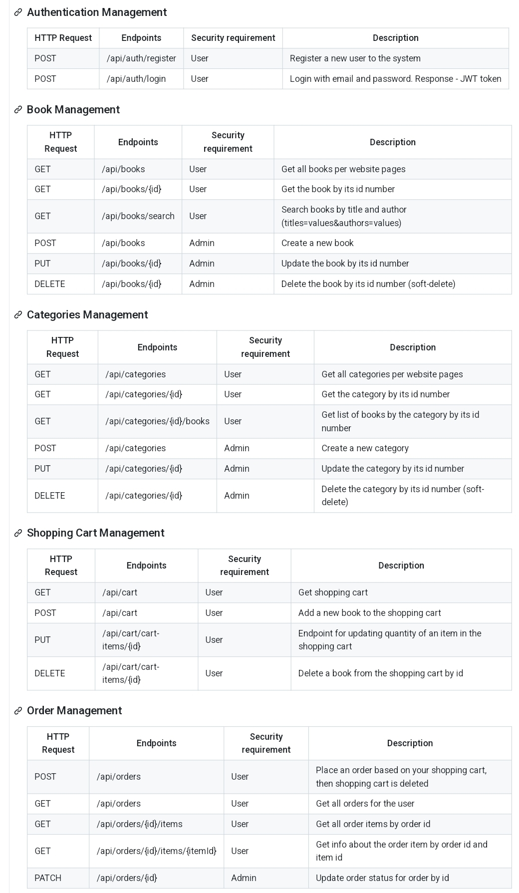

# **Online Book Store**

This is an online store project in which you can select books by authors and book titles, 
this helps you quickly find the book you need and place an order in the shortest possible time.
This project was inspired by the need for an efficient and scalable solution to streamline bookstore operations.

#  ⚙️ Technologies Used
* Java 17+
* Maven
* Spring Boot
* Spring Data JPA
* Spring Boot Security
* JSON Web Token
* Lombok
* MapStruct
* Liquibase
* MySql
* Hibernate
* JUnit5
* Testcontainers
* Docker
* Swagger

## 🛠️ Project Functionality:

User can have USER or ADMIN roles. USER role is assigned automatically to each newly registered user. One default user with role ADMIN is already added to database. <br />
Access types: 🟢 - unregistered user 🟡 - ADMIN role 🔴 - USER role
* AuthenticationController:
    * 🟢 login user;
    * 🟢 register new user;
* CategoryController:
    * 🟡 create a new category;
    * 🔴 get a list of all available categories;
    * 🔴 get category by id;
    * 🟡 update a category by ID;
    * 🟡 delete a category by ID;
    * 🔴 get all books with category id;
* BookController:
    * 🔴 get all books;
    * 🔴 get a book by ID;
    * 🟡 create a new book;
    * 🟡 delete a book by ID;
    * 🟡 update a book by ID;
    * 🟠 search a book by parameters;
* ShoppingCartController:
    * 🔴 add book to the cart;
    * 🔴 get all items in the cart;
    * 🔴 update book quantity;
    * 🔴 delete book from YOUR shopping cart;
* OrderController:
    * 🔴 create order;
    * 🔴 get orders history;
    * 🟡 update order status;
    * 🔴 get order by id;
    * 🔴 get special item from order by id;

## 🔗 Structure Entity 


## 🔗 Endpoints


* Authentication Manager 

POST: /api/auth/register

Example of request body to **register**:

```json
{
  "email": "john@example.com",
  "password": "123456789",
  "repeatPassword": "123456789",
  "firstName": "John",
  "lastName": "Alison",
  "shippingAddress": "1-st Awenye"
}
```
``` 
POST: /api/auth/login
```
Example of request body to **log-in**:

```json
{
  "email": "john@example.com",
  "password": "123456789"
}
```

## 🕹️ How to run the project locally:
* Ensure you have Docker installed on your system.
* Configure your database settings in the .env file.
* Open a terminal and navigate to the root directory of your project.
* Run the application using Docker Compose: docker-compose up
* Explore the endpoints using tools like Postman or Swagger
